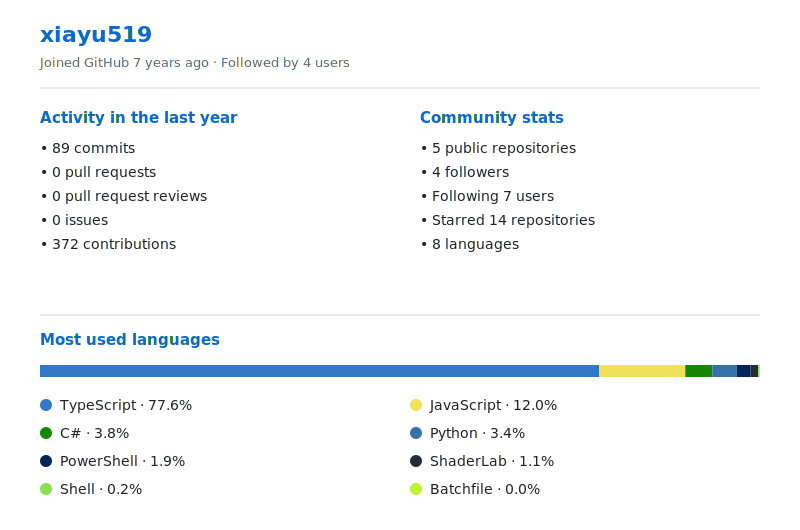

# Hi 👋, I'm xiayu519

### Game Developer | Unity & Cocos Creator

专注游戏客户端与框架开发，喜欢研究清晰、实用、可复用的游戏技术方案。

---

### 👨‍💻 About Me

- 🎮 Game Developer，主要使用 **Unity** 与 **Cocos Creator**
- 🛠️ 日常开发语言为 **C#** 与 **TypeScript**
- 🚀 [Tyou](https://github.com/xiayu519/Tyou) 作者
- 🌱 关注游戏框架设计、工程化与开发效率
- 📫 邮箱：[499793702@qq.com](mailto:499793702@qq.com)

### 🚀 Tyou

一个面向 **Cocos Creator** 的游戏开发框架，尤其适合有 Unity 开发经验、正在转向 Cocos Creator 的开发者。

### 📊 GitHub Metrics

  
  

---

欢迎交流游戏开发、Unity、Cocos Creator 与游戏框架设计。

